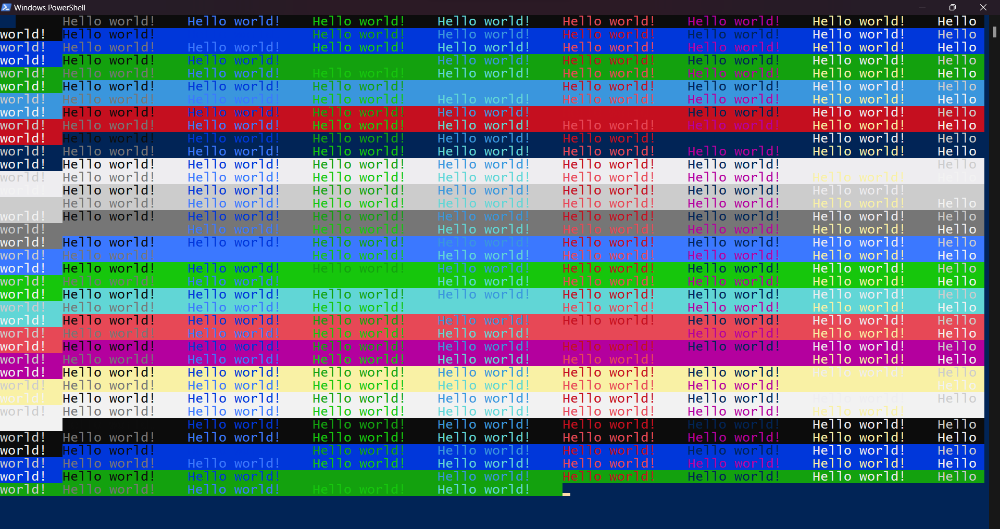

<p align = "center"></p>

---



---

> CppChalk is an headerfile which enables us to print colorful text to the standard output.

---

## Usage

---

- Download <a href = "https://github.com/Sam-Varghese/CppChalk/blob/master/src/chalk.h" download>chalk.h</a>.
- Now here is a code snippet explaining how to implement this header file

```cpp
#include "chalk.h" // Replace chalk.h with the relative path to the chalk.h header file

int main()
{
    Chalk Chalk;
    Chalk.red("Hello world");
}
```

---

## Supported colors

---

- Blue (`Chalk.blue`) 🟦
- Green (`Chalk.green`)🟩
- Cyan (`Chalk.cyan`) 
- Red (`Chalk.red`) 🟥
- Purple (`Chalk.purple`) 🟪
- Yellow (`Chalk.yellow`) 🟨
- White (`Chalk.white`) ⬜
- Grey (`Chalk.grey`) 
- Bright blue (`Chalk.brightBlue`)
- Bright green (`Chalk.brightGreen`)
- Bright cyan (`Chalk.brightCyan`)
- Bright red (`Chalk.brightRed`)
- Bright magenta (`Chalk.brightMagenta`)
- Bright white (`Chalk.brightWhite`)
- Background color Blue text color White (`Chalk.bgBlueFgWhite`)
- Background color Blue text color Black (`Chalk.bgBlueFgBlack`)
- Background color Blue text color Red (`Chalk.BgBlueFgRed`)
- Background color Blue text color Grey (`Chalk.BgBlueFgGrey`)
- Background color Blue text color Green (`Chalk.BgBlueFgGreen`)
- Background color Blue text color Cyan (`Chalk.BgBlueFgCyan`)
- Background color Blue text color Magenta (`Chalk.BgBlueFgMagenta`)
- Background color Green text color Black (`Chalk.bgGreenFgBlack`)
- Background color Green text color Blue (`Chalk.bgGreenFgBlue`)
- Background color Green text color LightBlue (`Chalk.bgGreenFgLightBlue`)
- Background color Green text color Red (`Chalk.bgGreenFgRed`)
- Background color Green text color Pink (`Chalk.bgGreenFgPink`)
- Background color Green text color Yellow (`Chalk.bgGreenFgYellow`)
- Background color Green text color White (`Chalk.bgGreenFgWhite`)
- Background color LightBlue text color Black (`Chalk.bgLightBlueFgBlack`)
- Background color LightBlue text color Blue (`Chalk.bgLightBlueFgBlue`)
- Background color LightBlue text color Green (`Chalk.bgLightBlueFgGreen`)
- Background color LightBlue text color Red (`Chalk.bgLightBlueFgRed`)
- Background color LightBlue text color White (`Chalk.bgLightBlueFgWhite`)
- Background color LightBlue text color LightGreen (`Chalk.bgLightBlueFgLightGreen`)
  
---

## Examples

---

- Checkout the [examples](/examples/) to know how to make use of this header file.

---

