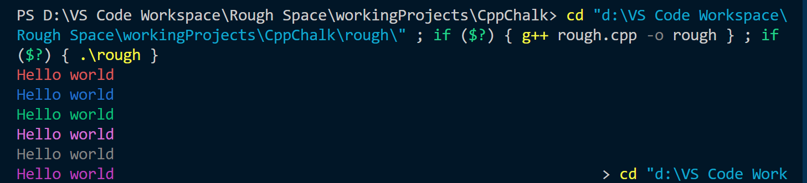

# Example 1

---

- Code executed

```cpp
#include "../src/chalk.h"

int main()
{
    Chalk Chalk;
    Chalk.red("Hello world\n");
    Chalk.blue("Hello world\n");
    Chalk.green("Hello world\n");
    Chalk.magenta("Hello world\n");
    Chalk.grey("Hello world\n");
    Chalk.yellow("Hello world\n");

    return 0;
}
```

---

- Output obtained

